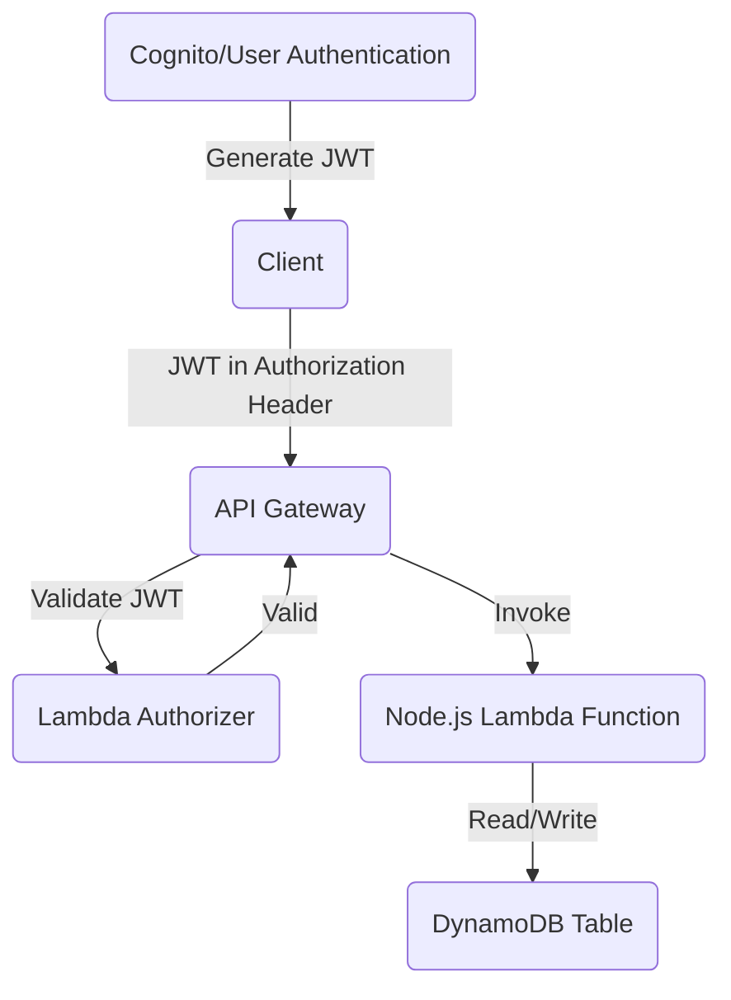

# chess

# links 
different reasons : Python - The python community is top notch and we ask and answer fun ML questions and jupyter is wonderful. Javascript - Client side code is hard to beat for snappy UX. Node - Sloppy stuff - and slow - but it sure is easy to stand something up. Java - java is the anti-node: a pain to set up, but once it is going it is bulletproof and wicked fast.

Some links github links: 
https://github.com/mulefish
https://mulefish.github.io ( graph I made to compare Japan and USA's politics - I made this just for a slack conversation that I was having but I liked it ) 
https://github.com/mulefish/seo_product_explorer ( ML + lulu product database to help with SEO organization for Lulu's Marketing Dept ) 
https://github.com/mulefish/wine2 ( python backend ) and  https://github.com/mulefish/wine2_ui ( react frontend ) : a toy 'Wine Store' using GloVe embeddings for a dummy recommendation engine : For python maybe a fun file to look at would be : https://github.com/mulefish/wine2/blob/main/pydata/vectorize_tokens.py 

